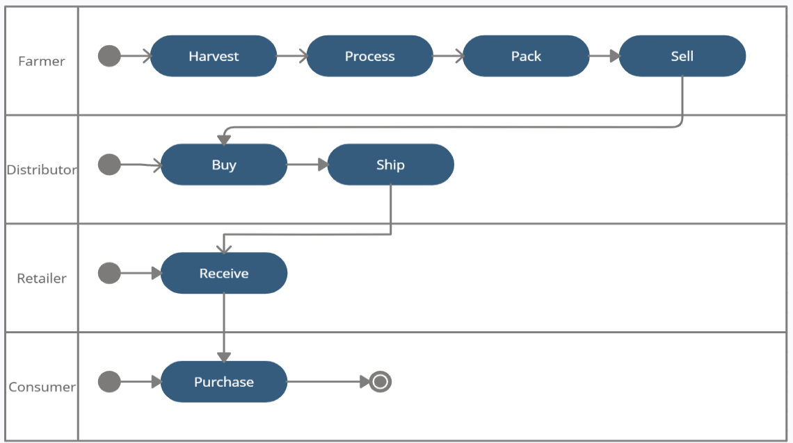
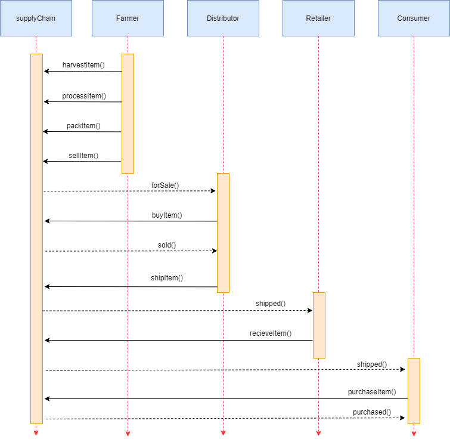
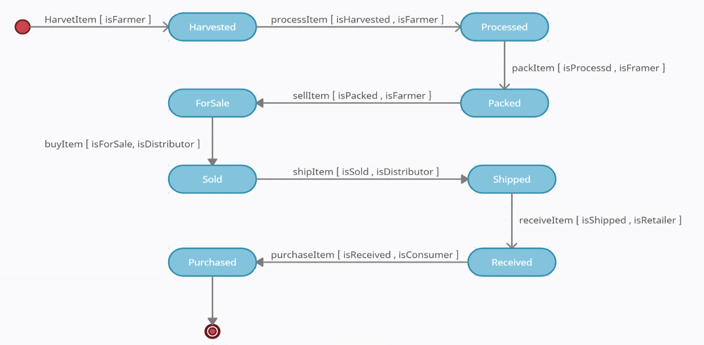
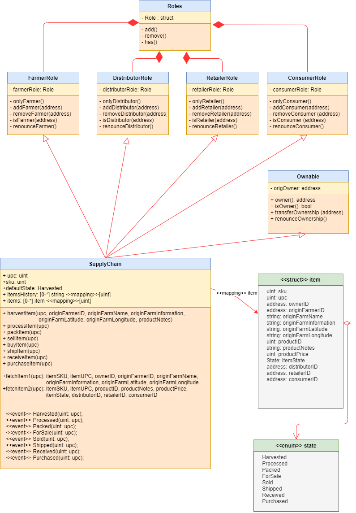
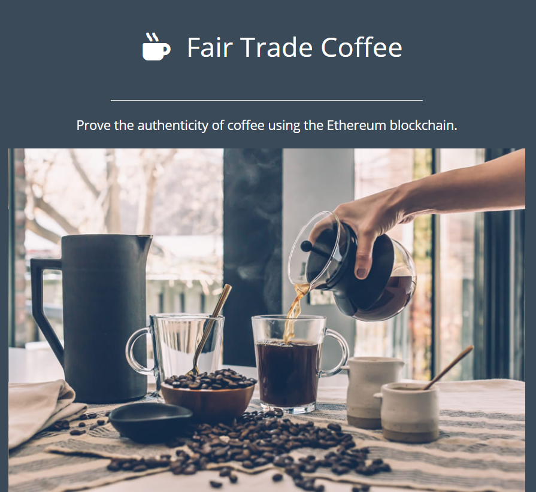

## Coffee Supply Chain DAPP

<br>

This Coffee Supply Chain Ethereum DAP created using smart contracts and can be deploy to rinkeby testnet or you can test it localy with ganache cli. This DAP is to demonstrate a supply chain flow strating from harvesting till purhcased by consumer. 


I used the following versions to run the project:  

```
Ganache CLI v6.12.2 (ganache-core: 2.13.2) 
Truffle v4.1.14 (core: 4.1.14)
Solidity v0.4.24 (solc-js)
Node v15.14.0  
Web3.js v1.3.5
```

<br>

Deployed to Rinkeby :

**Transaction Hash**:   0x8c41858033ce7a16f13d6b6eb9f51413aec702fe8748ce65d1987f919ea83a20

**Contract address**: 0xdd77b5d9534d54c1dcf46b4bd92168614ecf88fd

[Click here to see it on etherscan ](https://rinkeby.etherscan.io/address/0xdd77b5d9534d54c1dcf46b4bd92168614ecf88fd)

<br>

---

<br>

## Project UML Diagrams

#### Activity diagram



<br>

#### Sequence diagram



<br>

#### State diagram



<br>

#### Classes (Data Model)



<br>

### Libraries

#### Truffle

I use [Truffle](https://www.trufflesuite.com/docs/truffle/overview) as development environment to compile and migrate to local or rinkeby testnet.

<br>

#### truffle-hdwallet-provider

[HD Wallet-enabled Web3 provider](https://github.com/trufflesuite/truffle-hdwallet-provider) had been used to sign transactions for addresses derived from a 12-word mnemonic.

<br>

#### web3.js

web3.js is a collection of libraries that allow you to interact with a local or remote ethereum node using HTTP, IPC or WebSocket. for more info check their [documentation](https://web3js.readthedocs.io/en/v1.3.4/).

<br>

### IPFS

I did not use IPFS for this project.

[IPFS](https://docs.ipfs.io/) powers the Distributed Web. It is a peer-to-peer hypermedia protocol
designed to make the web faster, safer, and more open.

<br>

---

<br>

## Getting Started

Follow the instructions provided below to successfully launch this DAp.

<br>


### Step By Step

Please make sure you've already installed the following tools with the same version in order to prevent any problems.


Clone this repository:

```
git clone https://github.com/Basheer88/Coffee-DAPP
```


check which ganache-cli and Truffle version you have installed:

```
ganache-cli --version   

Ganache CLI v6.12.2 (ganache-core: 2.13.2)
```                                                                           

```
truffle version

Truffle v5.3.2 (core: 5.3.2)  
Solidity v0.5.16 (solc-js)  
Node v15.14.0  
Web3.js v1.3.5
```

```
npm install --save  truffle-hdwallet-provider@1.0.17
npm install web3
npm install lite-server
```

Navigate to SupplyChain Folder

```
cd SupplyChain
```

Launch Ganache:

```
ganache-cli 8545 -m "spirit supply whale amount human item harsh scare congress discover talent hamster"
```


In a separate terminal window, Compile your smart contracts:

```
truffle compile
```

Migrate smart contracts to the locally running blockchain, ganache-cli:

```
truffle migrate
```

Test smart contracts: All 10 tests should pass.

```
truffle test
```

In a separate terminal window, launch the DApp:

```
npm run dev
```

Now the frontend should open automatically if not then open a browser and go to the following address : http://localhost:3000/



<br>

---

<br>

### Deploy the smart contract to the Rinkeby Network

In a terminal window, Migrate smart contracts to the Rinkeby Network:

```
truffle migrate --reset --network rinkeby
```


